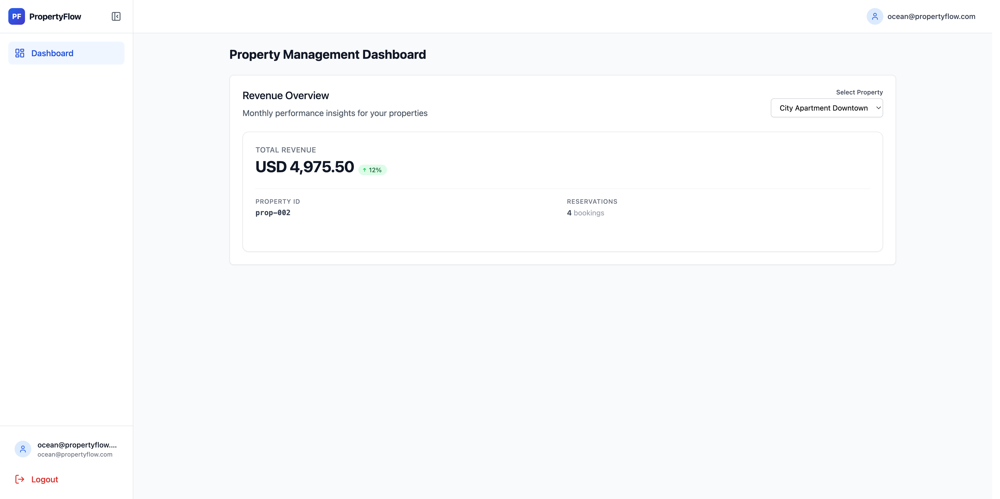
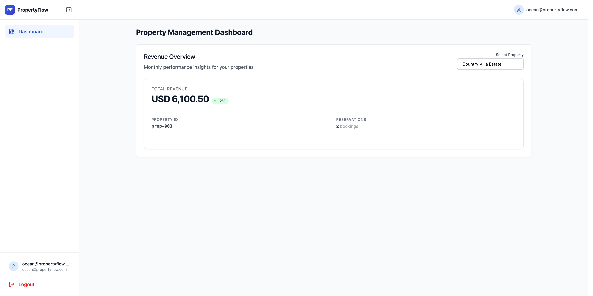
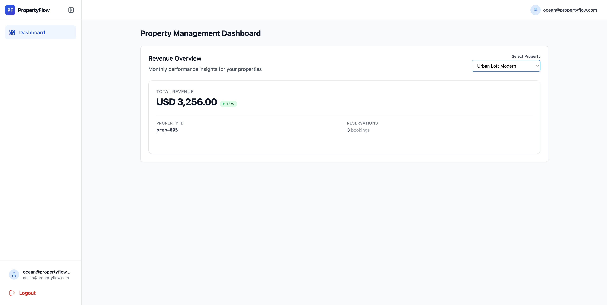

# Analysis for Ocean Rentals

Logged in as `ocean@propertyflow.com`.

## What I saw in the UI

| Property | ID | UI revenue | UI bookings |
|---|---|---|---|
| Beach House Alpha | prop-001 | 1,000.00 | 3 |
| City Apartment Downtown | prop-002 | 4,975.50 | 4 |
| Country Villa Estate | prop-003 | 6,100.50 | 2 |
| Lakeside Cottage | prop-004 | 1,776.50 | 4 |
| Urban Loft Modern | prop-005 | 3,256.00 | 3 |

Called the API with Ocean’s token. Same numbers as the UI. Same numbers as Sunset too.

## UI / API vs database

| Property | UI / API | DB (tenant-b) | Match? |
|---|---|---|---|
| Beach House Alpha (`prop-001`) | 1,000.00 / 3 | Ocean’s `prop-001` is Mountain Lodge Beta, 0 reservations | No |
| City Apartment Downtown (`prop-002`) | 4,975.50 / 4 | not Ocean’s property | Shouldn’t show |
| Country Villa Estate (`prop-003`) | 6,100.50 / 2 | not Ocean’s property | Shouldn’t show |
| Lakeside Cottage (`prop-004`) | 1,776.50 / 4 | 1,776.500 / 4 | Yes |
| Urban Loft Modern (`prop-005`) | 3,256.00 / 3 | 3,256.000 / 3 | Yes |

## Notes

- Ocean and Sunset see the exact same revenue for every property. That’s the privacy issue.
- `prop-001` is shared by both tenants in the DB, but with different names. Ocean should see Mountain Lodge Beta with no bookings. Instead it shows Sunset’s Beach House Alpha numbers.
- Dropdown lists Sunset properties: City Apartment Downtown (`prop-002`), Country Villa Estate (`prop-003`). Ocean shouldn’t see those.
- Lakeside Cottage (`prop-004`) and Urban Loft Modern (`prop-005`) match the DB, but that doesn’t fix the cross-tenant leak on the other ones.
