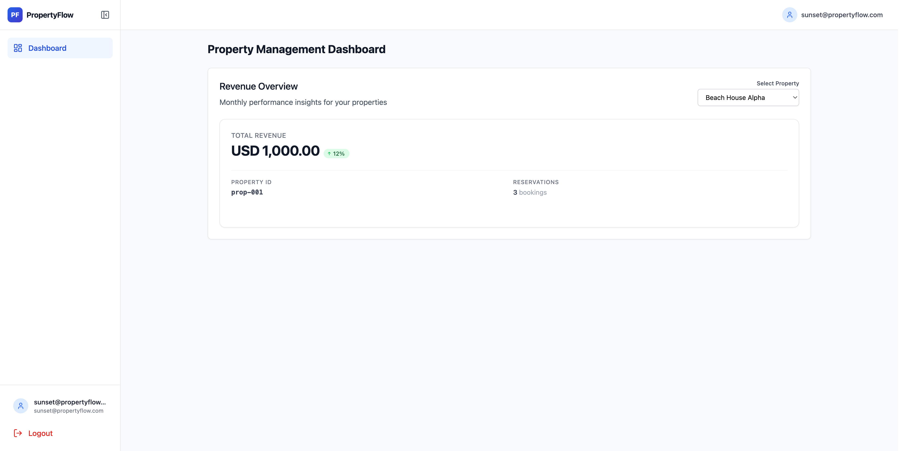
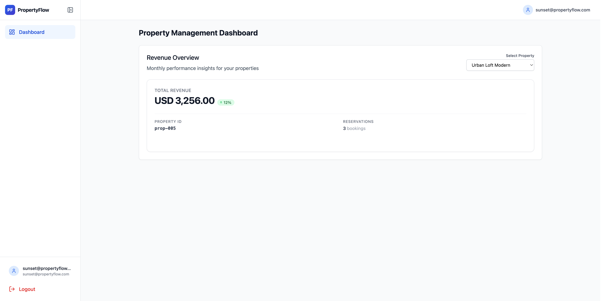

# Analysis for Sunset Properties

Logged in as `sunset@propertyflow.com`.

## What I saw in the UI

| Property | ID | UI revenue | UI bookings |
|---|---|---|---|
| Beach House Alpha | prop-001 | 1,000.00 | 3 |
| City Apartment Downtown | prop-002 | 4,975.50 | 4 |
| Country Villa Estate | prop-003 | 6,100.50 | 2 |
| Lakeside Cottage | prop-004 | 1,776.50 | 4 |
| Urban Loft Modern | prop-005 | 3,256.00 | 3 |

I also called the API with Sunset’s token. Same numbers as the UI.

## UI / API vs database

| Property | UI / API | DB (tenant-a) | Match? |
|---|---|---|---|
| Beach House Alpha (`prop-001`) | 1,000.00 / 3 bookings | 2,250.000 / 4 bookings | No |
| City Apartment Downtown (`prop-002`) | 4,975.50 / 4 | 4,975.500 / 4 | Yes |
| Country Villa Estate (`prop-003`) | 6,100.50 / 2 | 6,100.500 / 2 | Yes |
| Lakeside Cottage (`prop-004`) | 1,776.50 / 4 | not Sunset’s property | Shouldn’t show |
| Urban Loft Modern (`prop-005`) | 3,256.00 / 3 | not Sunset’s property | Shouldn’t show |

## Notes

- Beach House Alpha (`prop-001`) is wrong. DB has 4 reservations totaling 2250. UI shows 1000 and 3 bookings. That missing 1250 is `res-tz-1` (check-in `2024-02-29 23:30:00+00`).
- Dropdown also shows Ocean properties: Lakeside Cottage (`prop-004`), Urban Loft Modern (`prop-005`). Sunset shouldn’t see those.
- City Apartment Downtown (`prop-002`) and Country Villa Estate (`prop-003`) look fine against the DB.
